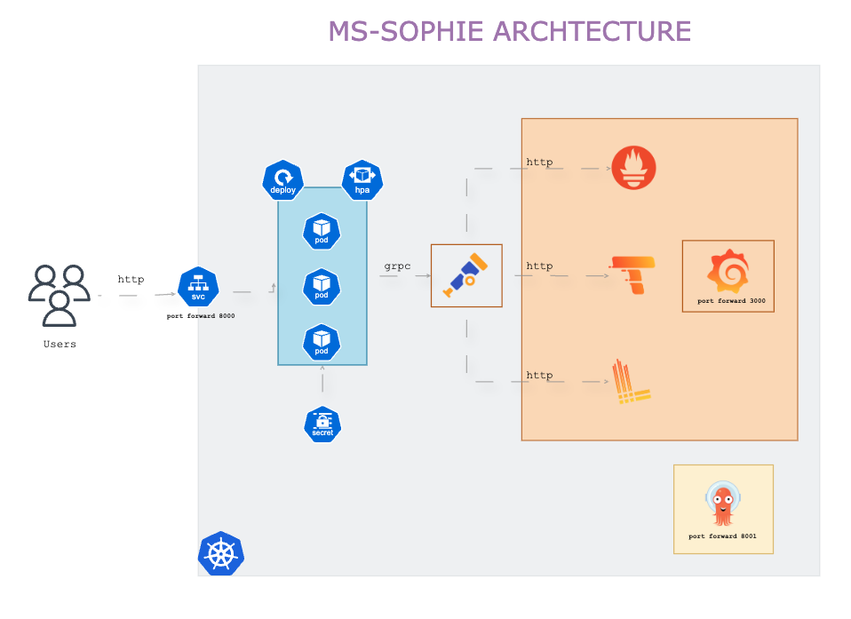

# Sophie

Sophie is a Go library that provides a simple and efficient way to retrieve brazilian stock prices to help you decide which stocks to buy or sell. It uses the [Alpha Vantage](https://www.alphavantage.co/) API to fetch stock data and provides a command-line interface (CLI) for easy access.

## Why Sophie?

The name Sophie was chosen because, in most cultures, it stands for wisdom. And when it comes to investments, let's face it: you need wisdom to make good choices.

When I mentioned the name to a few friends, one of them immediately thought of the book "Sophie's Choice", which is about tough decisions and their consequences. I knew right then that it was the perfect name. By the way, much better than "no-name-project" haha.

## CLI


1. set up your environment with alphavante api key: https://www.alphavantage.co/documentation/
```
API_KEY=
```

2. Install stock cli
```
go install github.com/marcosvliras/sophie/cmd/cli/sophie@latest
```

3. Add /go/bin to your PATH
```
export PATH=$PATH:$(go env GOPATH)/bin
```

4. How to use stock cli
```
sophie get --symbols=BBAS3,ITUB4
```
retreives the last price of the stocks BBAS3 and ITUB4

```
STOCK      ACTUAL PRICE  MAX PRICE
BBAS3.SAO  27.43         28.15
ITSA4.SAO  9.95          7.27
```

5. Local

- 5.1 install `make`
```
brew install make
```

- 5.2 install pre-commit
```
brew install pre-commit
pre-commit install
```

- 5.3 Clone the repository

- 5.4 go mod tidy

- 5.5 Build the project
```
go build -o sophie cmd/cli/sophie/main.go
```

# API 



1. set up your environment with alphavante api key: https://www.alphavantage.co/documentation/
```
API_KEY=
```


# Kubernetes

Deploy ms-sophie on Kubernetes with ArgoCD, and Grafana/Prometheus/Tempo/Loki for observability.

1. Set your API on argocd/sercrets.yaml
```
API_KEY: 
```

2. create namespaces below
```
kubectl create namespace argocd
kubectl create namespace ms-sophie
kubectl create namespace observability
```

3. Create secrets
```
kubectl apply -f deploy/secrets.yaml
```

4. Create the observability stack
```
kubectl apply -f deploy/grafana-lgtm.yaml 
```

wait for the observability stack to be ready and make a port-forward to access the UI on localhost:3000

```
kubectl port-forward service/lgtm 3000:3000 -n observability

```

5. install argocd
```
kubectl apply -n argocd -f https://raw.githubusercontent.com/argoproj/argo-cd/stable/manifests/install.yaml
```

6. wait for argocd to be ready and make a port-forward and access the UI on localhost:8001
```
kubectl port-forward service/argocd-server 8001:80 -n argocd
```

7. Get your argocd admin password, user=admin
```
kubectl get secret argocd-initial-admin-secret -n argocd -o jsonpath="{.data.password}" | base64 -d
```

or 

```
kubectl get secret argocd-initial-admin-secret -n argocd -o yaml (or json)
```

and get the password and decode it with base64

``` 
echo "PASSWORD" | base64 -d
```

8. Create an argocd application

```
kubectl apply -f deploy/application.yaml
```

9. make a port-forward to the server to make requests

```
kubectl port-forward service/ms-sophie 8000:80 -n ms-sophie
```

# Check if it's working

if everything is working, you should be able to access ArgoCD and Grafana ui


# Prometheus for metrics


# Tempo for tracing


# Loki for logs
